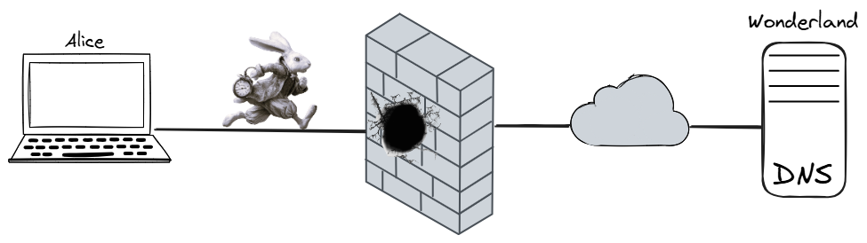
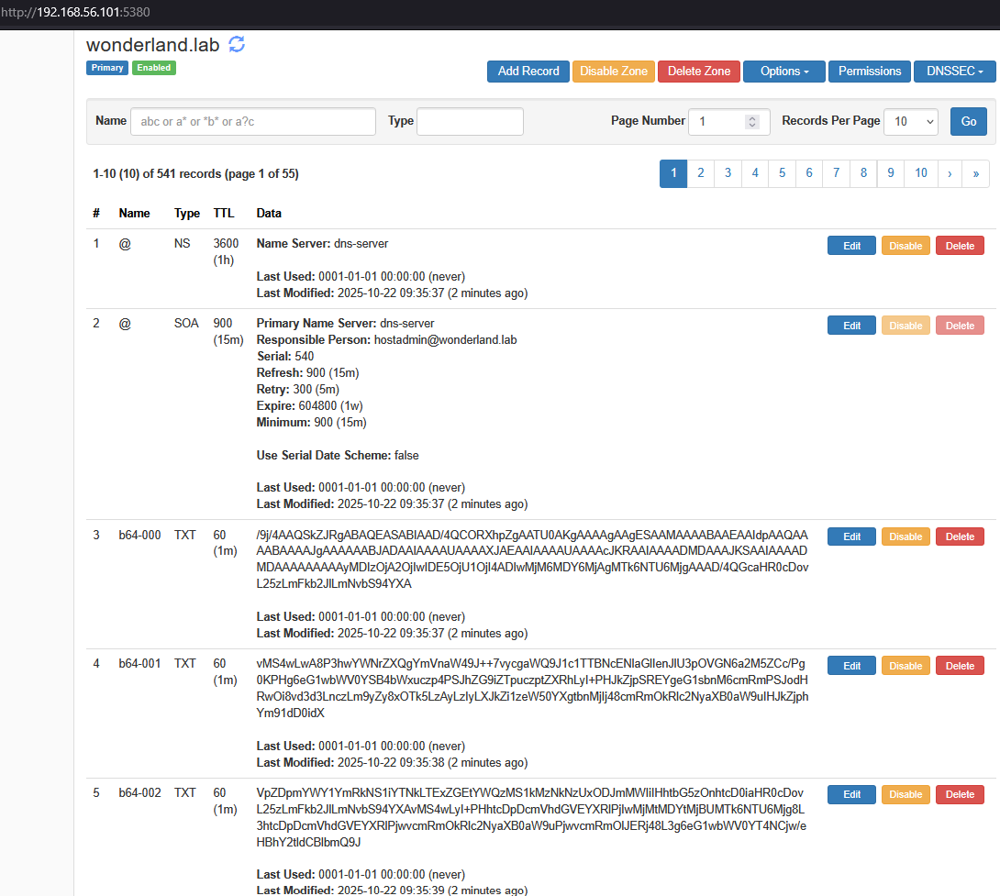
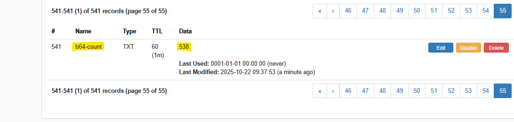

# dns-image-hosting

Hiding images inside DNS TXT records





## Description

DNS TXT records can be used both as a covert channel to upload and exfiltrate data (including images), or as a method to download content (let’s say an image) to a host while bypassing firewalls and content filters, since DNS traffic is often less scrutinized. This constitutes a misuse of the protocol’s features and may be flagged as a potential security threat.

How it works:

- An image is converted to a string of text (using Base64 encoding).

- This string is broken up into smaller chunks with fixed maximum size

- Each chunk is placed in a separate DNS TXT record.

- The records can then be retrieved to reconstruct the originale image.

This repository provideis a fully functional environment for testing image uploads and downloads to and from a DNS server.

The same can be done with any binary file.


## Disclaimer

The information provided in this repository is for educational and informational purposes only. All content is published in good faith and is intended to support ethical learning, especially in cybersecurity and networking-related fields. Users assume full responsibility for any actions taken based on the information, techniques, or tools contained herein. Any unauthorized use may constitute a violation of applicable laws and could result in legal consequences.


## HowTo

Basically, a compose file is provided to setup the DNS server and two bash scripts implement the upload and download operations; they share the information about DNS server, domain and TXT records naming convention. Downloaded content is saved into restored.image file.

```
# Ensure jq and curl are installed
command -v jq curl

# Start DNS Server - use compose file with docker or podman
cd compose
docker compose up -d
cd -

# Upload image
cd bin
chmod +x *.sh
./upload.sh ../images/alice.png
cd -

# Download image
cd bin
chmod +x *.sh
./download.sh

# Checks
# The retrieved image is stored into 'restored.image' file
cksum ../images/alice.png restored.image

```


## DNS content overview

```
# DNS UI  - see compose file for (weak and in plan text) credentials
http://<myipaddress>:5380
```

[...]



## Use cases

```
victim host -> upload   (exfiltrate data) 
victim host <- download (malware) 
```

## Limitations

- DNS propagation time vs binary size


## Mitigations

- Monitor DNS for frequent or large TXT record requests.

- DNSSEC

- [...]

## REFs

   https://hub.docker.com/r/technitium/dns-server
   
   https://github.com/TechnitiumSoftware/DnsServer/blob/master/APIDOCS.md
   
   https://stackoverflow.com/questions/296536/how-to-urlencode-data-for-curl-command


## Credits

Thanks to:

- The team at Technitium for their great work on popular open-source tools

- [Asher Falcon](https://github.com/ashfn) for having inspired [this topic](https://github.com/ashfn/dnsimg)

- [Vecteezy](https://www.vecteezy.com/free-photos/alice-in-wonderland)" for Alice

- [Jennifer](https://stock.adobe.com/it/search?k=alice+and+wonderland+rabbit&asset_id=1413750541) for the WhiteRabbiteRunnigLate


## TODO


- video

- profile image

- project -> public

